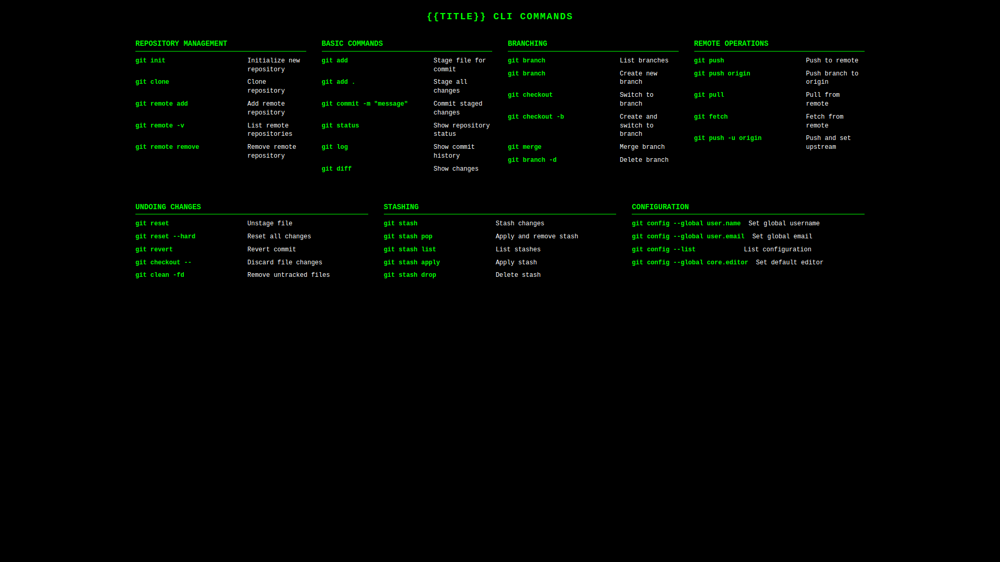
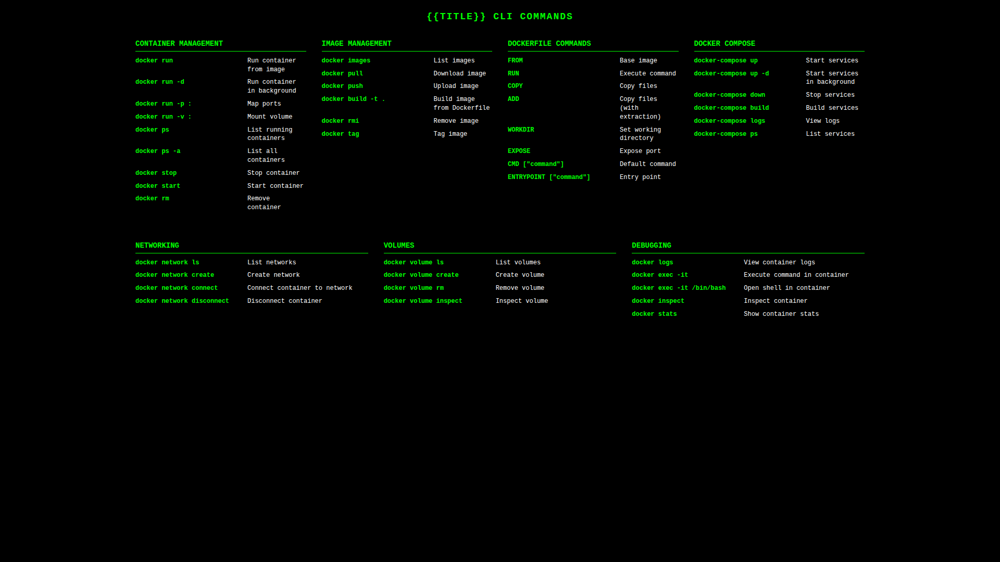
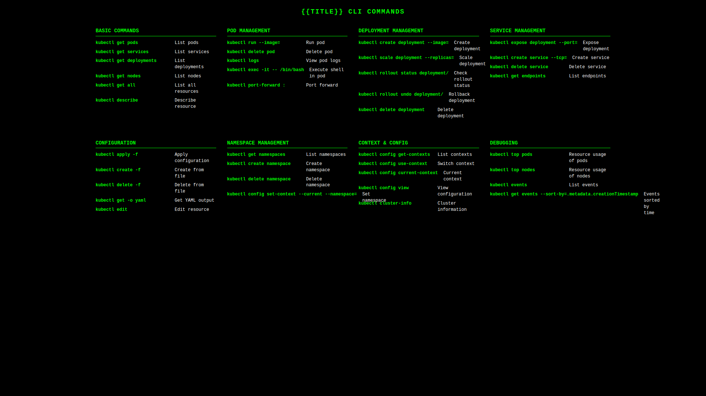

# 🖼️ CLI Wallpaper Generator

<div align="center">


**Transform CLI commands into elegant wallpapers for your desktop!**

[](https://opensource.org/licenses/MIT)
[](https://badge.fury.io/js/cli-wallpaper-generator)

</div>

## 🎯 What is it?

A TypeScript-based tool that generates elegant wallpapers with CLI cheat sheets in multiple resolutions. Perfect for developers who want quick reference guides as their desktop backgrounds.

## ✨ Features

- 🎨 **Multiple CLI Tools**: Support for Git, Docker, Kubernetes, npm, and Salesforce CLI
- 📱 **Multiple Resolutions**: Generate wallpapers in 1920x1080, 2560x1440, and 3840x2160
- 🚀 **Easy to Use**: Simple command-line interface and web interface
- 🎯 **Extensible**: Easy to add new CLI tools
- 💻 **TypeScript**: Fully typed and maintainable code
- 🌐 **Web Interface**: Interactive web app for on-demand generation
- 📊 **Resolution Scaling**: Proper text scaling for each resolution
- 🎭 **Playwright**: Modern browser automation for better screenshots

## 🖼️ Gallery Examples

### Git Commands Wallpaper
<div align="center">

</div>

### Docker Commands Wallpaper
<div align="center">

</div>

### Kubernetes Commands Wallpaper
<div align="center">

</div>

### npm Commands Wallpaper
<div align="center">

</div>

## 🌐 Live Demo

**Try it now:** [cliwallpaper.vercel.app](https://cliwallpaper.vercel.app)

The web interface is live and ready to use! Generate beautiful CLI wallpapers instantly.

## 🚀 Quick Start

### 1. Installation

```bash
# Clone the repository
git clone https://github.com/your-username/CLI-Wallpaper.git
cd CLI-Wallpaper

# Install dependencies
npm install

# Build the project
npm run build
```

### 2. Web Interface (Recommended) 🌐

```bash
# Start the web server
npm run server
```

Open your browser and navigate to `http://localhost:3000`

**Web Interface Features:**
- ✅ Interactive CLI tool selection
- ✅ Resolution picker with preview
- ✅ Real-time wallpaper generation
- ✅ Live preview of generated wallpapers
- ✅ Gallery with search and filtering
- ✅ One-click download

### 3. Command Line Interface 💻

```bash
# Generate wallpapers for a specific CLI tool
npm run generate git
npm run generate docker
npm run generate kubernetes
npm run generate npm
npm run generate salesforce

# Generate wallpapers for all CLI tools
npm run generate all

# List available CLI tools
npm run generate list

# Show help
npm run generate --help
```

## 🛠️ Available CLI Tools

| Tool | Description | Commands Included |
|------|-------------|-------------------|
| **Git** | Version control | clone, commit, push, pull, branch, merge, etc. |
| **Docker** | Container management | run, build, images, compose, etc. |
| **Kubernetes** | Container orchestration | kubectl commands |
| **npm** | Package management | install, run, publish, etc. |
| **Salesforce** | SF CLI commands | org management, deployment, etc. |

## 📁 Output Structure

Wallpapers are saved to the `./output/` directory with the following structure:

```
output/
├── git/
│   ├── git-1920x1080.png
│   ├── git-2560x1440.png
│   └── git-3840x2160.png
├── docker/
│   ├── docker-1920x1080.png
│   ├── docker-2560x1440.png
│   └── docker-3840x2160.png
├── kubernetes/
│   ├── kubernetes-1920x1080.png
│   ├── kubernetes-2560x1440.png
│   └── kubernetes-3840x2160.png
└── npm/
    ├── npm-1920x1080.png
    ├── npm-2560x1440.png
    └── npm-3840x2160.png
```

## 📐 Supported Resolutions

| Resolution | Description | Scale |
|------------|-------------|-------|
| **1920x1080** | Full HD | Most common desktop resolution |
| **2560x1440** | 2K | High-resolution displays with 1.33x scaling |
| **3840x2160** | 4K | Ultra-high-resolution displays with 2x scaling |

## 🏗️ Project Structure

```
src/
├── templates/
│   └── template.html          # Reusable HTML template with resolution scaling
├── data/
│   ├── git.json               # Git commands data
│   ├── docker.json            # Docker commands data
│   ├── kubernetes.json        # Kubernetes commands data
│   ├── npm.json               # npm commands data
│   └── salesforce.json        # Salesforce CLI commands data
├── types/
│   └── index.ts               # TypeScript interfaces
├── generator.ts               # Core generation logic with Playwright
├── server.ts                  # Express API server
└── index.ts                   # CLI entry point

web/
├── index.html                 # Web interface
├── styles.css                 # Frontend styling
└── app.js                     # Frontend JavaScript
```

## 🔧 Available Scripts

| Script | Description |
|--------|-------------|
| `npm run build` | Compile TypeScript to JavaScript |
| `npm run dev` | Run CLI in development mode with ts-node |
| `npm run generate` | Build and run the CLI generator |
| `npm run server` | Start Express web server |
| `npm run dev:server` | Start server in development mode |
| `npm start` | Start web server (alias for server) |
| `npm run clean` | Clean build and output directories |

## 🌐 API Endpoints

The web server provides the following REST API endpoints:

| Endpoint | Method | Description |
|----------|--------|-------------|
| `/api/clis` | GET | List available CLI tools |
| `/api/resolutions` | GET | List available resolutions |
| `/api/generate` | POST | Generate wallpaper on demand |
| `/api/wallpapers` | GET | List all generated wallpapers |
| `/api/preview/:cli/:resolution` | GET | Get preview of specific wallpaper |

## ➕ Adding New CLI Tools

1. **Create a new JSON file** in `src/data/` with the CLI name (e.g., `aws.json`)

2. **Follow the existing structure:**
```json
{
  "title": "AWS CLI",
  "sections": [
    {
      "title": "Section Name",
      "commands": [
        { "name": "aws command", "description": "Command description" }
      ]
    }
  ]
}
```

3. **The tool will automatically detect** the new CLI and make it available

## 📦 Dependencies

- **TypeScript**: Type-safe JavaScript development
- **Playwright**: Modern browser automation for screenshots
- **Express**: Web server framework
- **CORS**: Cross-origin resource sharing
- **Node.js**: Runtime environment

## 🤝 Contributing

1. 🍴 Fork the repository
2. 🌿 Create a feature branch (`git checkout -b feature/new-feature`)
3. 📝 Add CLI tool data or improvements
4. ✅ Test your changes
5. 📤 Submit a pull request

## 🚀 Deployment

This project is deployed on Vercel and available at [cliwallpaper.vercel.app](https://cliwallpaper.vercel.app).

### Deploy to Vercel

1. **Install Vercel CLI:**
```bash
npm install -g vercel
```

2. **Login to Vercel:**
```bash
vercel login
```

3. **Deploy:**
```bash
vercel --prod --yes
```

4. **Add custom domain (optional):**
```bash
vercel domains add your-domain.vercel.app
```

### Configuration Files

- `vercel.json` - Vercel deployment configuration
- `.vercelignore` - Files to exclude from deployment
- `api/index.ts` - Serverless API functions for Vercel

### Environment-Specific Behavior

The application automatically detects the environment and adapts accordingly:

- **Local Development**: Full Playwright functionality with real wallpaper generation
- **Vercel Production**: Mock mode with API responses for demonstration

This hybrid approach ensures the application works in both environments while providing clear feedback about available features.

## 📄 License

This project is licensed under the MIT License - see the [LICENSE](LICENSE) file for details.

---

<div align="center">

**⭐ If this project was useful to you, consider giving it a star! ⭐**

Made with ❤️ for the developer community

</div>